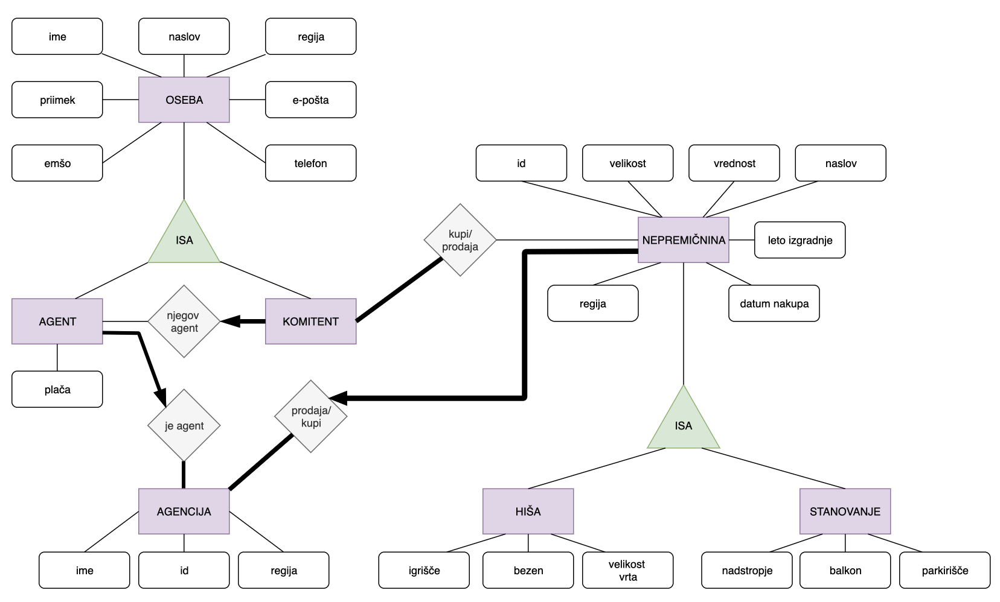

# Nepremičninske agencije
### Projektna naloga pri predmetu Osnove podatkovnih baz (Fakulteta za matematiko in fiziko).
#### Avtorji: Ana Marija Okorn, Nina Velkavrh, Neža Kržan

Slika ER-diagrama, na podlagi katerega smo oblikovale našo podatkovno bazo.

V projektu smo izdelale database za nepremičninske agencije, ki ga lahko uporabljajo agenti v nepremičninskih agencijah in komitenti.

## Uporaba strani za komitenta

Najprej se mora v stran vsak nov komitent registrirati(kasneje se določeni podatki lahko tudi spreminjajo). Ko se enkrat registrira, ga stran doda v database tabelo oseba in komitent.
Komitent se sedaj prijavi z izbranim uporabniškim imenom in geslom. Stran ga preusmeri na stran, kjer sta mu na voljo dva zavihka, in sicer vse nepremičnine in pa profil.

V zavihku `Nepremičnine` lahko komitent dostopa do vseh nepremičnin, omogočen mu je tudi vpogled samo stanovanj ali samo hiš. Komitent lahko tudi doda nepremičnino za prodajo.

V zavihku `Profil` se komitentu prikažejo vsi njegovi podatki in možnost spremembe le teh. Omogočena je tudi sprememba gesla.

## Uporaba strani za agenta

Agent se prav tako registrira in prijavi kot komitent. Po prijavi se mu odpre stran z zavihki `Nepremičnine`, `Agenti`, `Agencije`, `Pošte`, `Komitenti` in `Profil`.

V zavihku `Nepremičnine` si lahko ogleda vse nepremičnine vpisane v bazo, posebaj lahko pregleda hiše in stanovanja, pri vsaki nepremičnini lahko uredi ceno ali pa jo izbriše iz baze. Seveda pa lahko nepremičnino tudi doda v database.

Zavihka `Agenti`in `Agencije` mu služita za pregled in dodajanje novih agentov, ter vseh agencij, ki so vključene v database.

V zavihku `Komitenti` ima izpisane vse komitente in njihove osnovne podatke. Komitenta pa lahko tudi izbriše iz baze.

V zavihku `Profil` se agentu prikažejo vsi njegovi podatki in možnost spremembe le teh. Omogočena je tudi sprememba gesla.

## Spletni dostop
*  Aplikacija `bottle.py`
